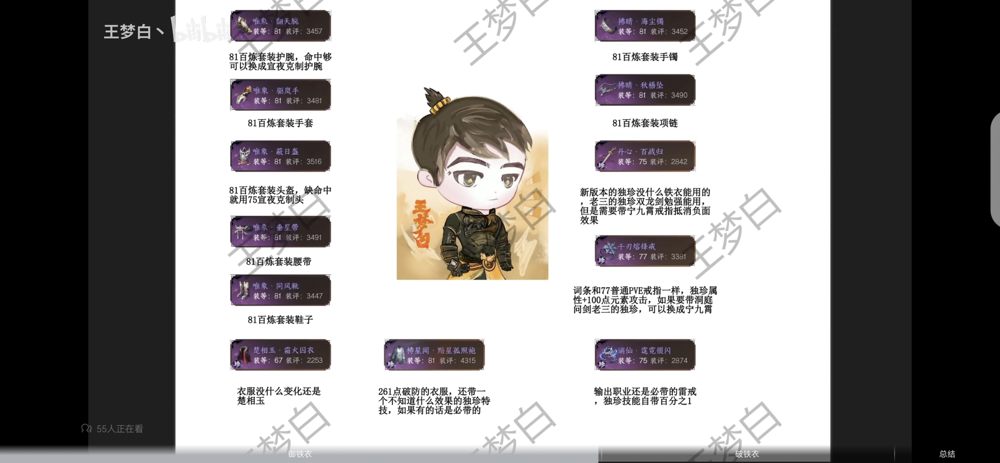
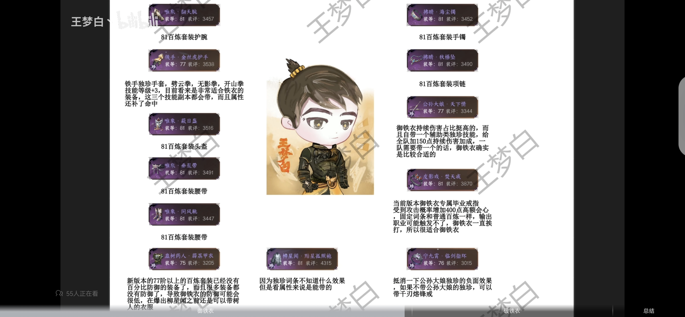

# 1.2.1铁衣流派装备搭配思路

>原作者：B站@王梦白丶 [原视频传送门](https://www.bilibili.com/video/BV1qH4y127rE)

## 0.菜菜注
>铁衣改版后，在目前的PVE百炼装备体系里没有再看到百分比防御的装备了，刚刚看到了一个视频，从装备上提供了铁衣两种形态的搭配思路，原视频请看上方传送门。
>
>考虑到视频转文字的内容比较多，我会在视频和文字内容的基础上提炼重要内容列在下方。文章内的“我”均为原作者。

## 1.旧的百炼装备去留

从77等级开始的百炼套装已经没有百分比防御装备，所以说防御可能会特别低；宣夜的百分比防御装备、之前的宣夜克制头，还有克制护腕都可以考虑保留不分解。

## 2.御铁衣的装备搭配思路

### 2.1 武器
根据等级来即可，因为77阶以上属性都一样，所以就直接放到81阶的了。

### 2.2 铁手独珍手
目前未开放，可通过12月4号华章任务获取，词条跟77阶的手套一样，也是加命中的。

独珍效果是劈云拳、无影拳、开山拳三个技能等级各加三级。目前而言，这个手套应该就是为铁衣量身定做的，非常契合铁衣，因为这三个技能副本都要带。

### 2.3 衣服
因为77阶以上的装备移除了百分比防御属性，会比较缺防御，可以带`古树药人`去补一下防御，出了柳星闻衣服之后可以把衣服换成柳星闻。

### 2.4 首饰 

首先是81阶的项链跟手镯两件套

另一个首饰可以带公孙大娘，因为御铁衣持续伤害占比还是挺高的，新版横扫进阶加了一个减伤；铁衣打本可以带横扫，然后再带个旋风腿和无影拳，就三个持续技能了，可以不带开山拳。

独珍特技祈福，给全队加150点持续伤害加成，一个队有一个人带应该就行了，铁衣带刚好，可以在自己获得效果加成之余为小队队友提供增益。

### 2.5 戒指

#### 2.5.1 焚天戒

戒指装备如果不出新的话，这是当前版本御铁衣，最接近毕业水平的戒指。

效果是`受击时概率获得400点会心`。正常副本只有铁衣一直在挨打，它可以一直给加400点的会心，对御铁衣来说是当前版本毕业水平的装备；固定词条它就跟81阶的百练是一模一样的。

#### 2.5.2宁九霄戒指

可抵消公孙大娘负面效果，可以考虑携带；

#### 2.5.3 千刃熔峰戒
如果不带公孙大娘的独珍，可以带千刃熔峰戒（分解紫色及以上品质非独珍装备可获得最高100点元素攻击），千刃可以考虑搭配丹心百战归。

御铁衣推荐装备一览

## 3.破铁衣

### 3.1 武器
武器还是没什么好说的，就什么高就带什么

### 3.2 防具
防具就是81的4件套，4+1。

### 3.3 头盔跟护腕

可以换成之前的宣夜克制头/克制护腕，只能换一件，具体看缺什么属性，如果缺命中就换克制头，缺会心就换克制护腕，

### 3.4 衣服

楚香玉的衣服或者树人衣服都可以，如果拿到柳星闻的衣服，输出职业肯定要带的，有261点破防

还有一个未知效果的特技，按之前的版本看，只要是独珍装备上带一个能打伤害的特技，伤害都没有低于1%的，楚香玉的衣服也好，雷戒（谪仙·霆霓银闪）的落雷也好，都特别高。

### 3.5首饰 
手镯跟项链就是81阶的套装，然后丹心百战归跟千刃熔峰戒，两个可以成一种组合。

还有一种组合，洞庭老三独珍，双龙剑加宁九霄的戒指，因为双龙剑有负面效果，所以说要宁九霄的戒指去抵消。

但宁九霄的戒指就稍微千刃熔峰戒一点点，因为目前没有老三双龙剑还没有实测，等到后面有的话我可以去测一下，我看大部分输出职业现在都是这样带的，所以我也这样带的。

### 3.6 戒指

没什么好说的，就是雷戒（谪仙·霆霓银闪）加千刃熔峰戒，属于目前最大众的搭配。

御铁衣推荐装备一览

## 4.后记

所以我跟大家说一下，就是新版本的装备虽然多，但这些独珍铁衣能用的也没有几件。

而且我们现在身上穿的这些装备，最高只开放到81阶，这些只是普通镜天阁的装备，英雄镜天阁还会开放新的装备，装等肯定是不是81阶毕业。

所以目前都是过渡，撑死了用了半个月就要扔了，不用过于焦虑，有什么用什么就行了。
