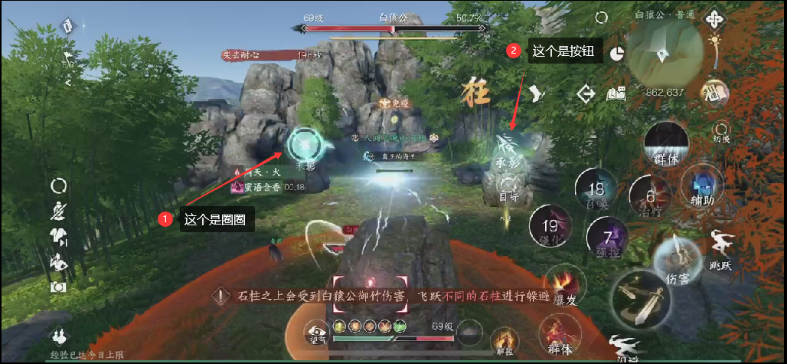

# 一些“怎么不等我鼠了再告诉我”的小技巧

更新时间：2023年12月15日 20:55:04

> 菜菜注：帮会群里最近出现了一些令人~~吹吹~~直呼“怎么不等我鼠了再告诉我”的小技巧，因此准备以此做个专栏，收集那些可以令人直呼爆冷的小技巧。
> 
> 目前先将收集到的内容整合在此文档内，后续会根据情况进行分类 ~~说的会有很多一样~~
> 
> 有新的足够冷的小技巧可以群里艾特菜菜，会及时（大概）搓上去的

正文开始前梗图一张

## 1.潜学流派快速提升熟练度

根据潜学的设定，熟练度是通过释放技能获取的，但是一般的手动/一键连招打木桩都太慢，这里介绍一种比较快的方法。

### 1.1 非绝技/潜学技能

1) 点击右上角菜单按钮，点击左下角`指引`模块
2) 在弹出的界面中找到`课业`(类似一颗象棋)
3) 找到任意教程进入
4) 在教程内`不按教程提示施放`需要提升熟练度的技能时，技能会定时重置CD
5) 反复施放直至熟练度提升完成即可

> 观察了一下山河提供的视频，在技能释放错误时会在若干秒后针对处在`冷却状态的技能`进行重置CD操作,相比等待技能本身的CD快得多。
> 
> 甚至可以利用这个思路同时刷两三个需要提升熟练度的技能，具体就看自己实际操作了:grin:

### 1.2 潜学技能

1) 确定好**需要提升的潜学流派技能**并携带至套路内
2) 装备燕无归的群侠技能`凛夜飒雪`或绝技`残心三绝剑`
3) 根据1.1内的步骤`进入课业教程`
4) 先释放**步骤2**内携带的技能
5) 如果看到自己轮盘的技能**恢复为自定义搭配**即为成功
6) 之后再参考1.1内的第四、五步骤释放潜学流派技能即可

> 这个技巧因为山河说的不是很详细，找了一下网络上的资料[传送门](https://www.bilibili.com/video/BV14H4y1B7ud)，发现在没有凛夜飒雪技能的情况下，可以使用三绝剑替代
> 
>但思路都是一样的，通过特定技能`变身激活个人套路技能搭配`，达到快速刷取熟练度的目的。~~虽然可能是个逻辑BUG，但是应该不会有人举报不会被修吧~~

### 1.3 绝技

1) 单人进入`武林风云录`副本
2) 开始战斗时绝技会`完全充能`，释放绝技
3) 退出并继续重复上述步骤直至提升完成

> 这个技巧是利用了1.1.3版本对已有副本绝技能量值规则的调整：`战斗开始时回复玩家的绝技能量值`
> 
> 理论上所有1.1版本的副本都可以这样操作，但武林风云录是比较短平快的，所以选择了武林

***
## 2.洞庭老一醉拳躲避

看了一下山河给的视频，拆解一下操作步骤

1) 到达醉拳机制
2) 第一次承影剑跳到石柱上
3) 转移视角，直至能`同时看到两个承影剑图标`（下面称呼为`圈圈`）
4) `连续快速`按下承影剑按钮（**注意不是圈圈喔**）直至机制结束

下面是一张参考图（来自山河）

> 现阶段可以按照这个技巧使用一下，虽然感觉还是BUG，但是可以根据自身情况使用一下
> 
> 理论上不在竞速时使用这种BUG问题就不大