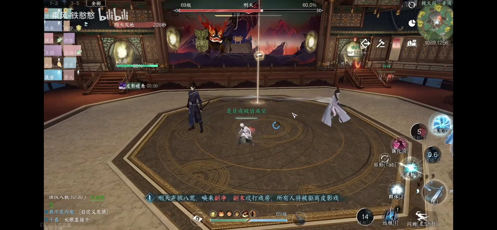

# 镜天阁禁阁普通机制一览

> 原作者：B站@乘风-铁憨憨 [传送门](https://www.bilibili.com/video/BV1Lc411B78z)
>
> 因为上班比较忙，暂时只转了老四的机制；老五的机制大概看过，可能下班之后抽空再转下
>
> 最近编辑时间：2023-12-04 15:45:23

## 1.皮影戏

输入`天下不服`开始副本

### 1.1 第一阶段-戏班

开场小BOSS：副末

需要保证在王鼎HP百分比为0之前消灭小BOSS，否则直接团灭

***

主要机制如下:

>黑衣刀客：理解为是小怪，揍他就完事了，血是不多的。
>
>吸力圈：站在圈里会出现一个吸力，把你往boss身上吸，`要一直往外走`，吸力还是比较强大。
>
>形破：点名的两个人脚下会出现白圈；**被点名**的人`远离大团`就可以了，灵性点这个也很好躲。

击杀完成后`迅速进入`皮影戏，**左右均可进入**。

### 1.2 第一阶段-皮影戏

进入场景后，需要有一位`最灵性的队友`去拿神杖。

这个道具非常重要，在**本阶段场景**和**第二阶段戏班场景**均需要用到，如果无法妥善处理机制则会`全队团灭`。

介绍一下该场景内的攻击方式：

>1) 近战：高伤害；使用长剑劈砍，可以**跳跃攻击**，躲避敌人技能。`第三次攻击`会使下次最后一击造成额外伤害。
> 
>2) 远程：（按钮为回血）远程弓箭打到怪可以回血，如能**瞄准蓄力回血更高**；使用弓箭速射，少量回复气血。`每三次速射`还会提高下次瞄准射击回复的气血。

每个玩家都可以在近战/远程之间进行切换，按需使用即可。

> 特别注意：**素问是在这里是奶不了血的**，需要自己留意血线（~~或者让团长盯着~~）

由T拉面向，在BOSS背后的输出可以切近战输出高伤害。

在BOSS前面的输出根据自己血线情况而定。

需要多留意自己的血量，如果血量较低需要拉开和BOSS的距离使用远程弓箭回血。

***

呼兵唤将：会有猴子献祭王鼎，需要使用神杖延缓献祭并清理猴子。

`神杖玩家`在这个机制开始使用神杖，其他玩家切近战去击杀猴子。

该机制完成后继续攻击刑天直至击杀即可。

刑天死亡后，场景内会出现`忠义猴`，手持会爆炸的罐子，尽快清理即可。

>注意：刑天第一次死亡后，场上只要有队员血不满，就继续切远程，来继续射刑天，还是一样能回血的。

## 1.3 第二阶段-皮影戏

进入了第二阶段，刑天复活，复活以后继续输出，把他削到70%的血量后，所有玩家会被驱逐出皮影戏回到戏房。

## 1.4 第二阶段-戏房

小BOSS副净、副末（一黑一白）会被召唤到戏房场景内，尽快击杀两个小BOSS。

出门后，两个T将小BOSS拉到1号点（附图示），全体输出集火即可。

> 戏房平台由一内一外两个八边形组成，其中内部八边形为正八边形，外部八边形为非正八边形
> 
> 简单的定位方法是
> 1) 找到外部八边形最长的一条边（在幕布前），然后沿着中心方向，再找到离它**最近的一个点**
> 2) 从找到的点向圆心方向**小走两三步**
> 3) 标点
> 
> 下面给个简单图示

此阶段会有`形破机制`，参照上文规避即可。

独有机制介绍：

> 火山石：出现火山石时，包括一号点在内的各个点位会有一个火山石，拥有一定的伤害范围
> 
> 如爆炸时站在范围内，则会受到`巨额伤害`。 
>
> 持有神杖的玩家将一号点附近的火山石清理掉即可。

## 1.5 第二阶段-皮影戏

待两个小BOSS被清理后，再次进入皮影戏，将刑天击败即可。机制和上文类似，不再赘述。

>需要注意的是第二次呼兵唤将机制召唤的不一定是攻击王鼎的猴子。
> 
> 左右侧可能会有名为“牛头”“马面”的小怪，注意及时清理即可。