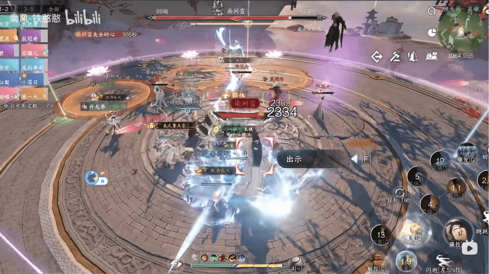

# 镜天阁外阁英雄新增机制一览

> 2024-01-01 19:17:13：补充了老一红圈的施放细节、老二画卷外水墨形体的可选建议和老三二阶段原有机制对玩家的不利影响

> 写在前面：对比了网络上现有的攻略视频，英雄难度相比而言增加了一些新机制；为了节约篇幅，**仅**对英雄难度中**新增**的/**基于普通难度上有调整**的机制内容进行介绍。
>
> 因为时间比较紧张，未经过充分的验证，可能会和实际情况有一定出入，如有问题请不吝指正
> 
> 参考视频:[英雄镜天阁副本：薛北鲲（老一）](https://www.bilibili.com/video/BV1xc411k7DZ)/[英雄镜天阁副本：墨先生（老二）](https://www.bilibili.com/video/BV1Kw411V76o)
> /[英雄镜天阁副本：南问雪（老三）](https://www.bilibili.com/video/BV16e41167vY)/[【逆水寒手游】英雄镜天阁1-3攻略，新任宝宝本没有机制，DPS达标就直接碾压](https://www.bilibili.com/video/BV1Dw411G7Wv)

## 1.薛北坤

### 1.1 新增机制：猎鹰繁衍后代

1) 机制`倒计时8秒`，会在**猎鹰休憩恢复**倒计时条结束后`3-4秒`开始倒计时
2) 倒计时结束后，场地内会出现四个鸟蛋，如果`7秒`内不将鸟蛋击碎会孵化出小猎鹰
3) 孵化出的小猎鹰会有以下其中一种效果（在小猎鹰名字下会注明）

> 只会啄挠：有一定伤害，无其他特殊/负面效果
> 
> 只会吹风：有一定伤害，并会给予**冰冻定身效果**约`3-4秒`
> 
> 只会鸣叫：鸣叫时若站在小猎鹰**面前会受到高额伤害**，如站在小猎鹰**背后则不会受到高额伤害**
> 
> 练习时长两个月：这种小鹰会在场上胡乱冲刺，**被冲刺到的玩家**受到伤害

可参考思路：在条件允许的前提下尽量集中集火鸟蛋/小猎鹰

***

### 1.2 新增机制：BOSS范围红圈

> 注:这个机制在现有看到过的视频里是出现在`繁衍后代`机制内，但由于只出现了一次，目前考虑将该部分单独拎出来写

在**猎鹰繁衍后代**阶段，小猎鹰孵化出约`8秒`后，薛北坤脚下会出现一个**范围红圈**

红圈扩散时间约`1秒`左右，且会带来**高额伤害**；`1秒`后会出现一个**半圆形扇形**，扩散完成时间`0.5秒`，也会带来**高额伤害**

所以需要大家注意在特定时间提前准备规避该机制，防止吃到伤害

## 2.墨先生

### 2.1 机制调整：水墨形体·巨像

由普通的一个巨像锁定一名玩家升级为`三个巨像各锁定一名玩家`

机制处理的方法还是一样的

***

### 2.2 机制调整：圆形AOE伤害

这个机制的BOSS抬手动作为`起跳`，在空中**停留约1秒后**落地，对圆圈内的人造成**巨额伤害**

DPS需要在看到动作的时候**尽快躲避**，素问如有条件可以考虑给小队带上约定

***

### 2.3 机制调整：画卷内黑色墨点

站在墨点上时的伤害提升，输出停留大约`3秒`左右会暴毙

注意躲避即可

***

### 2.4 机制调整：画卷外水墨形体

墨点必须所有人都踩，如有未被吸收的墨点会在`4秒`后生成具有较高伤害的水墨形体（长得像黑色触角）

> 吸收墨点时会`持续受到伤害`，需要素问注意小队血量

如果有出现黑色触角的话，T拉怪远离触角所在区域即可

> 注：如`团队伤害允许`，可以全程在画卷内与BOSS战斗，以规避对该机制的处理

***

### 2.5 新增机制：画卷外墨意值

类似洞庭老二的`剑意`百分比

当墨意值达到`30%`、`70%`时会触发**溢出**效果，对范围玩家造成伤害

溢出效果实际上就类似爬塔里的十字架红线,注意灵活躲避即可

## 3.南问雪

### 3.1 机制调整：桃花女

数量上升为**6个**，首先在`暴雨梨花`阶段后约`3-4秒`出现三个桃花女

之后在分身机制前，三朵荷花所在区域红圈扩散完成后再出现三个桃花女；荷花的样子参考下图

### 3.2 机制调整：踏雪寻梅（分身）

数量由4个上升为6个，每60°（角度）会有一个分身/真身

### 3.3 机制调整：第二阶段原有机制

清空有利BUFF：如被BOSS的机制技能命中受到伤害，则会**清除**玩家`自身所有增益BUFF`

技能释放速度：英雄难度机制的释放速度会加快，体现比较明显的是`陨石`机制；处理机制时需要注意时间

### 3.4 机制调整：尘蝶一梦

1) 前四只幻境灵蝶被击败时，**必定掉落**翅膀，击败第五只幻境灵蝶开始将**不再掉落**翅膀。
2) 南问雪周围将出现四只拥有护盾的幻象，必须**先击破四只幻象的护盾**，才能削弱南问雪本体的护盾。
3) 南问雪周围将不定时刷新四组金色光环，穿过金色光环可以增加破盾效率，穿过的金色光环越多，破盾效率越高。

参考思路：

>最开始进入阶段时尽快击败四只小蝴蝶
>
>拿上翅膀上天的玩家需要留意是否有可穿过的光环
>
>而地上的玩家需要留意弹反，如有幻象坠落优先集火幻象