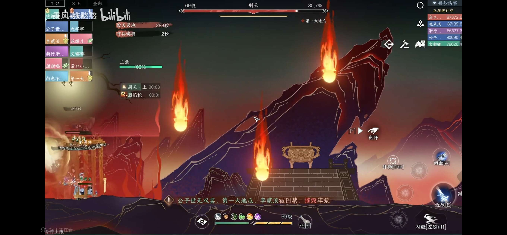
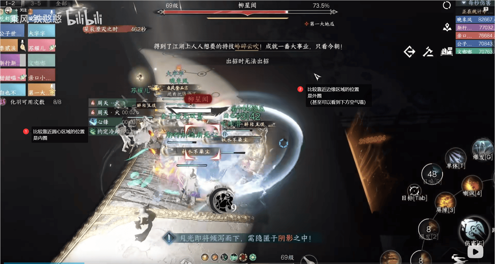

# 镜天阁禁阁英雄机制新增/调整一览

> 2024-01-15 14:09:16 编写完老四的文字攻略
> 
> 2024-01-15 15:58:50 编写完老五的文字攻略
> 
> 2024-01-15 19:45:46 编写完老六的文字攻略，老四内增加了省流版描述和1.7小节，老五调整了灵体的机制和伤害描述，传送门增加了引用链接

> 写在前面：为了节约篇幅，**仅**对英雄难度中**新增**的/**基于普通难度上有调整**的机制内容进行介绍。
>
> 参考的攻略里团队基本为高秒伤，如果秒伤刚过线，可能需要按照团队情况调整机制处理方法；
> 参考内容可能会有增加，本次参考的所有视频链接将列在文章最后。

##  1.皮影戏

> 省流版：在黑白双煞出现时`双T记得拉开`，刑天`不能靠普通平A破定`；其它新机制难度尚可，可着重查看加粗文字
> 
> 由于普通难度机制弱化，需要**留意曾经的旧机制**，请参考1.7小节

### 1.1 新增机制：牛头/马面/猴子（戏房）

简单介绍一下击败后掉落的戏服效果，请注意一件戏服效果**只能使用一次**：

1) 牛头戏服-大地怒击：可以立刻摧毁刑天的囚笼
2) 马面戏服-箭雨：可以立刻摧毁皮影戏中的所有陨石
3) 猴子戏服-重生：戏中重伤可以立刻重返戏台

可参考思路: 碎梦、龙吟可以在小怪出现时去及时清理
> 菜菜注：根据参考的攻略，在秒伤较高的前提下（顶尖9W+，前五7.9W+），第一波可以不打小怪，具体请根据王鼎掉血情况决定。~~或者就不要参考这条思路老老实实打~~

***

### 1.2 新增机制：囚笼（戏中）

机制倒计时结束时，会随机点名**两位**（刑天第一阶段）/**三位**（刑天第二阶段）玩家释放囚笼，被点名玩家会被限制在囚笼范围内。

> 可参考思路：
> 1) 如囚笼在大团里，可以由大家一起**输出打破囚笼**
> 2) 如囚笼在非大团范围（例如左右侧），则**优先**让**牛头戏服玩家使用技能**打破牢笼；如没有可用的牛头戏服则参考上一条

***

### 1.3 新增机制：狂怒陨石雨（戏中）

`仅刑天第二阶段出现`，机制倒计时结束时，会从屏幕上方往下掉落**垂直向下**的陨石雨。如触碰到陨石会受到伤害。

普通机制时存在的**红色区域**可能会和**该机制一起进行**，如下图所示。

> 可参考思路：
> 1) 在该机制未结束前，尽量**不使用跳劈**，而是**依靠位移/冲刺**躲避掉落的流星雨
> 2) 如有马面戏服的队友，可以在陨石大部分都在**中间**时使用**戏服技能**，清除所有陨石

***

### 1.4 新增机制：蛮力冲撞（戏中）

刑天会在左侧/右侧蓄力约`7-8秒`，蓄力期间会**露出弱点**，蓄力完成后弱点隐藏，向相反方向冲撞。

> 可参考思路：
> 1) 留意系统下方中间的**提示**，会**指明刑天所在区域**，尽快赶到
> 2) 跳跃并使用近战攻击，如攻击有效会**削弱刑天定力条**，定力条被打空则进入**破定状态**

***

### 1.5 机制调整：黑白双煞（戏房第二阶段）

严格来说应该不叫机制调整。要注意**将黑白双煞分开**，否则合体会产生巨额伤害，属于本关的**团灭点**。

根据攻略作者的经验，双煞出现时需要由两个T将黑白双煞分开，**不能合在一起打**。

至于输出先后，有先集火一个再集火另一个的，有两边分队伍集火的，且两者输出水平接近（前五7.5W+,顶尖9W+），请根据团队自身情况决定。

***

### 1.6 机制调整：刑天破定（戏中）

普通难度时，玩家对刑天的平A是可以削弱定力条的；但在英雄难度时**无法通过平A削弱定力条**。

目前已知的破定方式清参考1.4小节。

***

### 1.7 机制调整：形破/找回形体（戏班）

形破（黑白圈）：**回到了**普通最开始的`3个`影子，需要注意**不传染其他玩家**/**不被其他玩家传染**

找回形体（找影子）：从实况视频来看，需要**注意进的顺序**，否则容易造成大团高额伤害；第一个人先进，奶妈**留好约定**，后面**两个人一起进再去拉约定**

## 2.黑白双意

> 省流版：老五的已知机制调整是禁阁内最少的，主要**注意处理冰锥和灵体**即可

### 2.1 新增机制：冰雷灵体

在冰锥**引雷阶段结束**后，会在地图的**四角各出现**一个冰雷灵体。

每个灵体会**点名并跟随**一位玩家，当灵体和玩家距离非常近（贴身）时，会以灵体为圆心，产生一个红圈；

`1秒`后给予红圈范围伤害（伤害是否可以由减伤技能降低有待测试，且从实况视频来看`输出受到该伤害会暴毙`）。

> 可参考思路：
> 1) 可以在贴近出现红圈时使用**位移、加速技能**移出红圈/~~**解控技能**减伤~~，铁衣可以使用`金刚铁壁`弹反
> 2) 由队友使用**冰雷枪**击破

***

### 2.2 新增机制：剑气

黑白双意在释放`冰雷锁`后，会分别锁定3名携带冰锁、雷锁的玩家释放`剑气`攻击。

东钧、西铮会**被对方释放的剑气所伤害**。

> 可参考思路：被点名的玩家根据自己攻击的BOSS，找到另外一个BOSS并站在其身后，等待BOSS释放剑气即可；
根据实况结果会削`2%`的血

***

### 2.3 机制调整：冰锥/冰雷枪

冰锥落下时会出现**两个**巨大冰锥，每个巨大冰锥需要由**三道雷**击破，方可得到**特殊冰雷枪**。

特殊冰雷枪可由两名队友传功，可传功时有类似老六/钧天浩意的传功按钮，成功传功可触发`合击`，对BOSS造成巨额伤害。

> 可参考思路：出现大冰锥的时候，每个冰锥**站三个引雷队友**即可
> 
> 特殊冰雷枪则由**近点队友拾取**并由**其他附近队友传功**即可

## 3.柳星闻

> 省流版：老六新增/调整机制内容相比老四也比较少，但黑夜的新增/调整机制比较考验团队的协作配合能力
> 
> 而白天的影子也需要团队从容应对，避免无谓的伤亡

### 3.1 新增机制：影·柳星闻（黑夜）

每次月光倾泻（从**月牙形状**躲到阴影里的阶段）后，将会出现`影·柳星闻`，每只影·柳星闻在**结算阶段**将为柳星闻**恢复**`3%`气血。

如被技能击中3或4次（具体看头顶）

玩家拥有应对该机制的新技能和BUFF
1) 影杀：玩家进入阴影中，可以释放该技能在**原地生成**自己的影子
2) 影回：玩家进入月光区域时，可以释放该技能**瞬间移动**到自己的影子处
3) 月光充能：玩家在月光区域时，会进行充能，充能`4秒`后发动影回技能可对`影·柳星闻`造成伤害

> 可参考思路：
>
> Ⅰ.人员安排
> 1) 平均输出水平`刚过线或过线不多`的情况：定好需要放影子的四个人，最好是低输出或者奶妈/T
> 2) 平均输出水平远高于水平线可以不参考这一条，根据实际情况随便定四个人就行
> 
> Ⅱ.在月牙躲避时，定好放影子的队友需要到外圈（远离圆心），**对准**柳星闻**起跳的位置**，使用影杀技能放下影子
> 
> Ⅲ.如果需要**降低拿灯队友清影子的压力**，请**未被指定的队友**在躲月牙影子的时候**回到内圈**（下面有图示）
> 
> Ⅳ.**未确定机制**：同时按影回技能可能会让`影·柳星闻`仅受到一次伤害，由于`机制未经验证`，请在该阶段时留意此情况，并及时调整安排

***

### 3.2 机制调整：起舞弄影（白天）

召唤的影子变成了**2对**

> 可参考思路：大团聚拢靠近BOSS，铁衣可带铁壁/不动禅心做第一次抵挡，若第一次未抵挡成功需要素问看团队情况拉约定；实际请根据团队队员技能情况而定
>
> **未确定机制**：大团靠近BOSS，BOSS不会再释放三连斩技能，团队可在机制来临时留意此情况
> 
> 菜菜注：不动禅心建议到`化境`阶段再装配，否则`1.5秒`的**护盾施加时间**非常考验释放时机；

***

### 3.3 机制调整：星落寰宇

1) 点名玩家由普通难度的1位变成**2位**
2) 捡起星辰弹反或传功后**无法再次捡起**星辰，需要捡起`3片`地上的**发光碎片**才可再次传功

> 可参考思路：
> 1) 机制开始前定好`6位`**主传功**的队友，可以从奶/T/低DPS中选择
> 2) 所有队友开始时还是去捡星辰
> 3) 如果是`非主传功`队友需要弹反，则四位`主传功`队友按情况传功即可；如`主传功`队友需要弹反，由其他`主传功`队友进行传功即可
> 
> 第三条核心是为了在输出吃紧的开荒时期给高DPS**挤出输出时间**，如果团队平均输出较高可以根据实际情况决定。

## 4.参考视频传送门

> [【王梦白】英雄镜天阁禁阁456攻略](https://www.bilibili.com/video/BV16V411R77M)
> 
> [英雄镜天阁禁阁：皮影戏（老四）全程详细讲解](https://www.bilibili.com/video/BV1vW4y1c7HS)
>
> [英雄镜天阁禁阁：黑白双意（老五）](https://www.bilibili.com/video/BV11t4y1R7Aq)
>
> [英雄镜天阁禁阁：柳星闻（老六）全程详细讲解](https://www.bilibili.com/video/BV1NK411e7kV)
> 
> [来自@Zliking的老五实况视频](https://www.bilibili.com/video/BV1Jw411J7Wd)