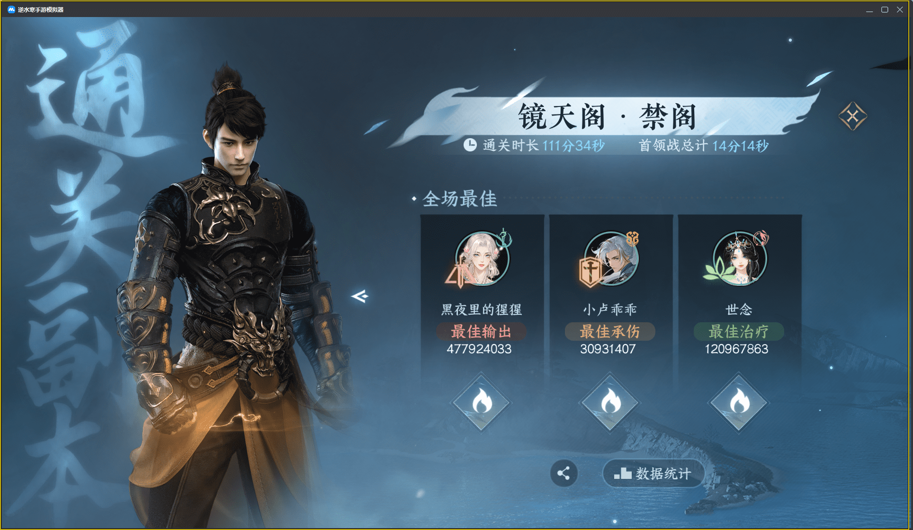
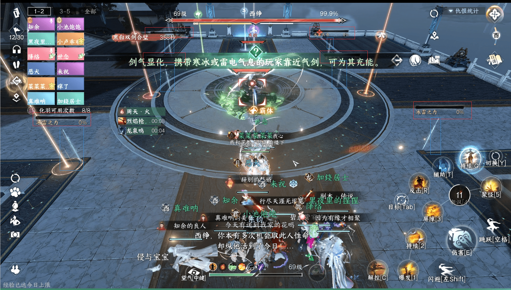
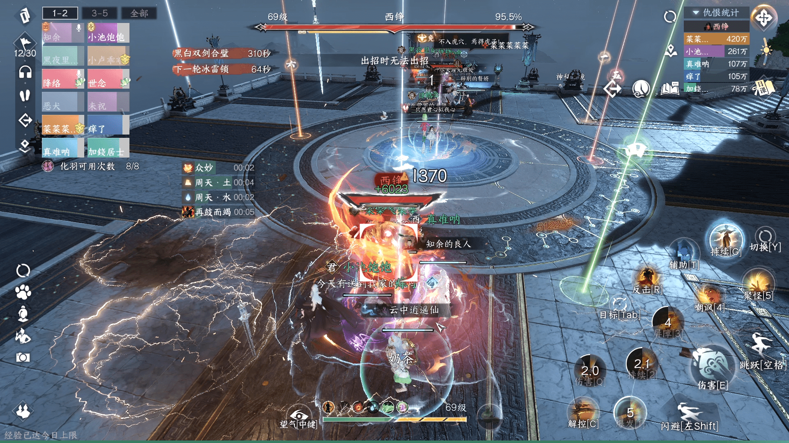
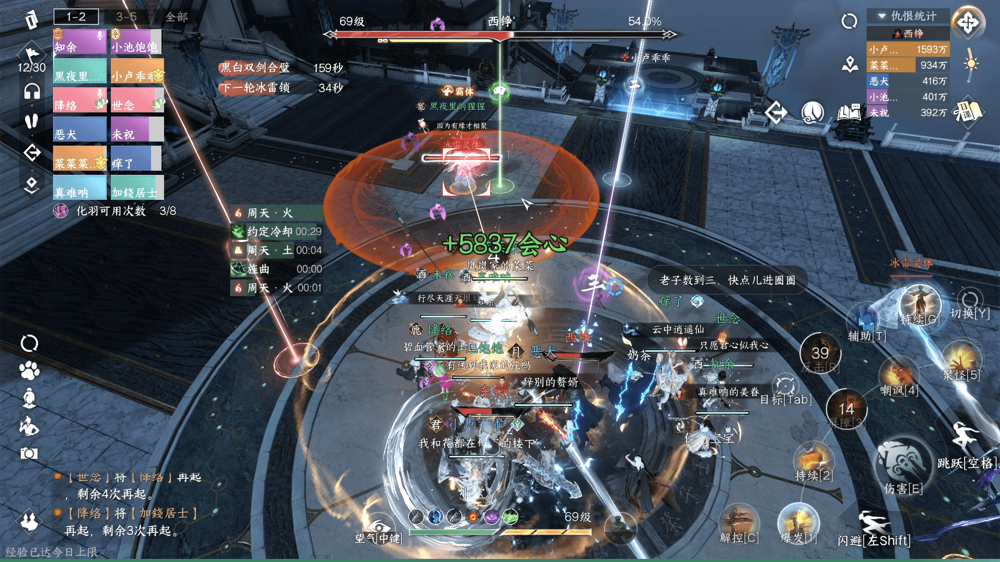

# 镜天阁史诗挑战个人复盘

> 今天下午蹭了个打史诗五六的团，熬了110+分钟终于是过去了（老五约70分钟，老六约41分钟）
> 
> 我就按照个人的经历尽量拆一下机制和需要注意的团灭点，给大家做个参考
> 
> 19:33记：老五的细节比较多，所以写的有点久，老六相对新机制不多，后面抽空再写
> 
> 页面可以双指放大缩小，不用担心图看不清了

# 1.黑白双意

## 1.1 速评

增加了一些机制，属于是难度中等但需要认真处理不能划水的机制，处理不当可收获~~极速落地成盒~~速开速灭的体验。

## 1.2 机制介绍

尽量把机制都覆盖到，有的机制因为重要会多写点，有的按照以前的方式处理即可

### 1.2.1 双半屏

> 多打伤害

这个阶段目前基本以在一侧内**限时爆发输出**，从开怪开始到互相消锁有余约12-13秒的输出时间。

有看到的可行建议如血河腾龙开、素问开长歌等等。

鉴于自己不是输出，给不出更多的建议了，大家可以集思广益。

### 1.2.2 冰雷之力

> 半屏阶段打过的BOSS拿2把枪，没打过的BOSS拿4把枪

史诗里的BOSS，多了护盾值的概念。

需要在交换完冰雷锁之后，给特定位置的冰雷之力充能，充能完毕后对BOSS进行攻击，可以大量削弱护盾值。

具体位置如下图红色/蓝色方框所示（分别代表**充能进度条和实体**）

***

可参考的思路是如果在双半屏阶段打了东钧，那么消锁之后需要去西铮的四个DPS，去拿靠近西铮位置的剑。剩余两把剑让打东钧的DPS拿。反之同理。

### 1.2.3 冰雷锁

> 简短点说就是除了消锁阶段**停手保命**，还要多留意炸弹是不是在传递，有条件建**议多开麦沟通**。
> 
>下面是对机制的详细介绍和处理建议

这个机制相比原来多了一个`巨型冰雷锁`（下面简称炸弹），会在倒计时`6秒`结束时**传递**（如范围内有**异色圈**）/**消失**（如范围内为**同色圈**或**无其他圈**）

作用就像之前葫芦蛋在群里提到的，用来打断两个BOSS的全屏AOE（下面会提这个机制）；所以在全屏AOE到来前，要保证炸弹是一直在的。

***

所以处理机制，除了最开始的互相消锁外，又多了一个互传炸弹的环节。

`消锁`就不说了，两次半屏之后记得停手，尤其是特定有**AOE伤害**的技能/**90的药人**之类。

> 一定**不要在这个阶段死亡**，否则可能会导致两个素问的圈为同色，增加后续机制处理的难度。

传递方面，一般来说两队素问脚下的圈互为异色，基础的思路让两个**异色**素问在**中间互传**；这种方式可以在同样的时间内挤出更多的输出

> 上面这张图其实就是比较典型的站位，输出在各自BOSS脚下，两个素问站在中间互相传圈，能尽量压缩传圈机制对DPS和T的影响。

但如果运气不好，两个素问为同色的话，就需要喊异色的DPS来帮忙。所以建议**有能开麦的素问**，亦或者指挥能多留意中间的情况。

### 1.2.4 冰锥引雷

> 下一轮冰雷锁**进度条**还剩`60s`时出现

机制没有变化，DPS准备停手集中到中间

东钧（下称小白）放锥子时**放太极图**就不说了，西铮（下称小黑）引雷时让铁衣**开不动禅心**，引爆冰锥不受伤害且节约时间。

### 1.2.5 雷霆/寒冰爆破（全屏AOE）

> 下一轮冰雷锁**进度条**还剩`41s`或`40s`时出现

需要由身上有炸弹的人让BOSS处在自己的爆炸范围内，也就是**黄圈炸小白**，**白圈炸小黑**，两波都炸完了就可以把炸弹带出大团了。

被打断之后的BOSS会在原地不动（且称为扶剑），大致的样子可以参考下图里的小黑（特效开的有点花，见谅）

需要注意，每次机制会**释放爆破的BOSS不一定一样**，可能是小黑，可能是小白，也可能都放，所以需要根据提示灵活应对。

### 1.2.6 灵体与冰雷枪

> 下一轮冰雷锁**进度条**还剩`41s`或`40s`时出现

灵体没啥好说的，如果离大团太近带出去，引完了再回来；个人有一种实践操作是可以用小枪在大团里打灵体（T位置）

大枪没有特殊情况不要打BOSS，因为这个机制是和上一个雷霆机制**一起出现**的；如果把BOSS打后退太多可能会导致传炸弹的人无法炸到指定的BOSS。