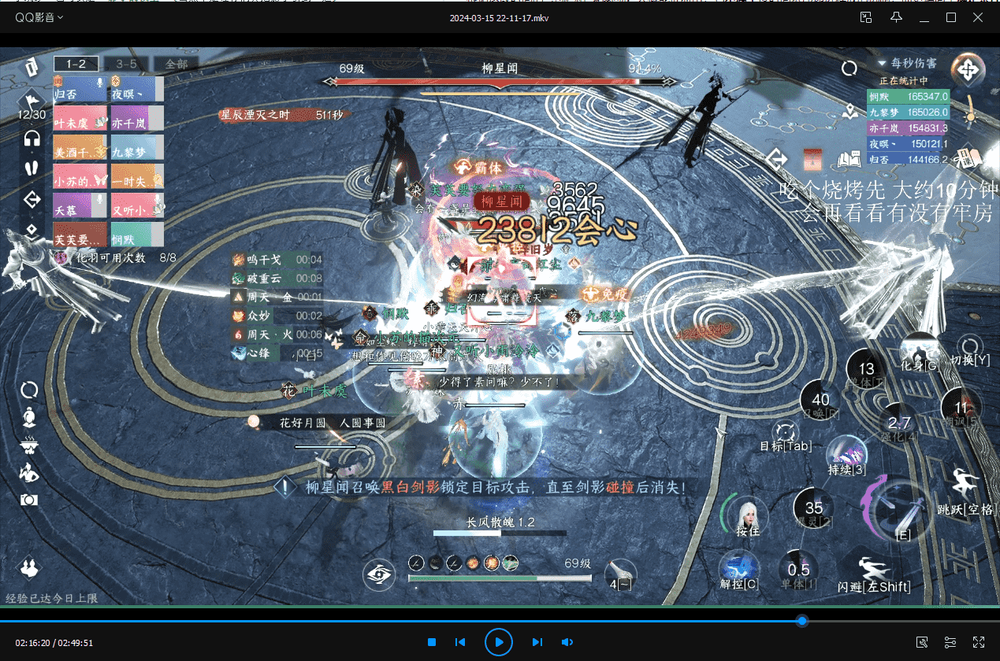
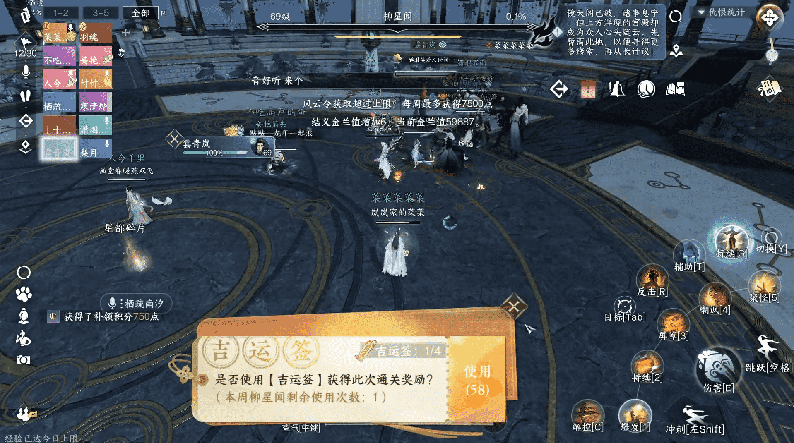

# 镜天阁史诗挑战个人复盘

> 今天下午蹭了个打史诗五六的团，熬了110+分钟终于是过去了（老五约70分钟，老六约41分钟）
> 
> 我就按照个人的经历尽量拆一下机制和需要注意的团灭点，给大家做个参考
> 
> 19:33记：老五的细节比较多，所以写的有点久，老六相对新机制不多，后面抽空再写
> 
> 页面可以双指放大缩小，不用担心图看不清了

# 1.黑白双意

## 1.1 速评

增加了一些机制，属于是难度中等但需要认真处理不能划水的机制，处理不当可收获~~极速落地成盒~~速开速灭的体验。

## 1.2 机制介绍

尽量把机制都覆盖到，有的机制因为重要会多写点，有的按照以前的方式处理即可

### 1.2.1 双半屏

> 多打伤害

这个阶段目前基本以在一侧内**限时爆发输出**，从开怪开始到互相消锁有余约12-13秒的输出时间。

有看到的可行建议如血河腾龙开、素问开长歌等等。

鉴于自己不是输出，给不出更多的建议了，大家可以集思广益。

### 1.2.2 冰雷之力

> 半屏阶段打过的BOSS拿2把枪，没打过的BOSS拿4把枪

史诗里的BOSS，多了护盾值的概念。

需要在交换完冰雷锁之后，给特定位置的冰雷之力充能，充能完毕后对BOSS进行攻击，可以大量削弱护盾值。

具体位置如下图红色/蓝色方框所示（分别代表**充能进度条和实体**）

***

可参考的思路是如果在双半屏阶段打了东钧，那么消锁之后需要去西铮的四个DPS，去拿靠近西铮位置的剑。剩余两把剑让打东钧的DPS拿。反之同理。

### 1.2.3 冰雷锁

> 简短点说就是除了消锁阶段**停手保命**，还要多留意炸弹是不是在传递，有条件建**议多开麦沟通**。
> 
>下面是对机制的详细介绍和处理建议

这个机制相比原来多了一个`巨型冰雷锁`（下面简称炸弹），会在倒计时`6秒`结束时**传递**（如范围内有**异色圈**）/**消失**（如范围内为**同色圈**或**无其他圈**）

作用就像之前葫芦蛋在群里提到的，用来打断两个BOSS的全屏AOE（下面会提这个机制）；所以在全屏AOE到来前，要保证炸弹是一直在的。

***

所以处理机制，除了最开始的互相消锁外，又多了一个互传炸弹的环节。

`消锁`就不说了，两次半屏之后记得停手，尤其是特定有**AOE伤害**的技能/**90的药人**之类。

> 一定**不要在这个阶段死亡**，否则可能会导致两个素问的圈为同色，增加后续机制处理的难度。

传递方面，一般来说两队素问脚下的圈互为异色，基础的思路让两个**异色**素问在**中间互传**；这种方式可以在同样的时间内挤出更多的输出

> 上面这张图其实就是比较典型的站位，输出在各自BOSS脚下，两个素问站在中间互相传圈，能尽量压缩传圈机制对DPS和T的影响。

但如果运气不好，两个素问为同色的话，就需要喊异色的DPS来帮忙。所以建议**有能开麦的素问**，亦或者指挥能多留意中间的情况。

### 1.2.4 冰锥引雷

> 下一轮冰雷锁**进度条**还剩`60s`时出现

机制没有变化，DPS准备停手集中到中间

东钧（下称小白）放锥子时**放太极图**就不说了，西铮（下称小黑）引雷时让铁衣**开不动禅心**，引爆冰锥不受伤害且节约时间。

### 1.2.5 雷霆/寒冰爆破（全屏AOE）

> 下一轮冰雷锁**进度条**还剩`41s`或`40s`时出现

需要由身上有炸弹的人让BOSS处在自己的爆炸范围内，也就是**黄圈炸小白**，**白圈炸小黑**，两波都炸完了就可以把炸弹带出大团了。

被打断之后的BOSS会在原地不动（且称为扶剑），大致的样子可以参考下图里的小黑（特效开的有点花，见谅）

需要注意，每次机制会**释放爆破的BOSS不一定一样**，可能是小黑，可能是小白，也可能都放，所以需要根据提示灵活应对。

### 1.2.6 灵体与冰雷枪

> 下一轮冰雷锁**进度条**还剩`41s`或`40s`时出现

灵体没啥好说的，如果离大团太近带出去，引完了再回来；个人有一种实践操作是可以用小枪在大团里打灵体（T位置）

大枪没有特殊情况不要打BOSS，因为这个机制是和上一个雷霆机制**一起出现**的；如果把BOSS打后退太多可能会导致传炸弹的人无法炸到指定的BOSS。

# 2.柳星闻

## 2.1 很长的速评
本来是想在那天晚上打完之后写的，但是因为各种原因且后面坐牢的时候老六过的都相对容易。所以没有抽时间出来写。

但是，昨天晚上（3.15），我和悯默在老六还是坐了一个小时的牢:sweat_smile:。

个人感觉被野团氛围给迷惑了，以为洒洒水；现在看来还是因为以蛋总为首的队友们给力，大家真的很棒。

## 2.2 机制/设定介绍

> 如果有你记得但没有提到的机制，就说明实际上没有任何变动（比如传功）

### 2.2.1 三连斩设定（白天）

> 只要能和柳星闻贴紧，包围住他，就不会出现三连斩机制。如果已经出现了在侧面躲会儿，不要贴太近。

根据这段时间的`经验`和`录像回放`大概能推断出，它**不属于**按时间依序递进释放的机制，而更偏向于**满足条件后释放**的机制。

> 必要条件：白天释放其他机制（黑白圈/黑白影）/其他特定条件+机制结束/条件满足后柳星闻未被**完全包围**住。
>
> 且包围柳星闻的，**不局限**于玩家，也可以是**影子的模型**(当然不是让你们真把影子引到一边)

提到其他特定条件的原因是，有一次是没完全贴紧，但三连前没有其他机制出现，无法判断出触发条件，考虑到比较罕见，可以先当作BUG。

机制大致流程是：蓄力——转个大半圈——长条——半圆——中短条——半圆——END

且三连斩本身也可以被特定模型阻挡（看回放没看出来是什么模型，但确实是在原地运动），就是顺带提一嘴。

> 3.16中午记：如果影子撞掉之后在柳的脚下，是可以让柳在原地转圈的；当然听听就好，因为很难控制每次都是这样。

***

史诗中尽量跳过三连斩机制的方式就是所有人站在柳的**各个方向**上，**贴**近，**堵**住他。

如果三连斩正在释放，`御T`可以在**第一个半圆释放完**后开铁壁格挡，基本可以挡住到阶段结束的四次攻击。还可以反打给伤害。

非御T，**不要头铁**，躲在侧面；且尽量和地上标识的形状边再拉开一些距离，防止被机制边缘擦到的可能性。

> 多说一句：偷师的铁壁是没有类似御T的格挡反击效果的，老老实实躲就是了。

### 2.2.2 白圈/黑圈（白天）

> 遇到后记住一个字：**躲**

两个机制差不多，就放在一起讲。

白圈出现方式和以前一样，都是随机位置出现白圈。

黑圈属于史诗新机制，开始时已经显示了所有黑圈的位置。

伤害非常高，可以暴毙，所以已经不能用拉约定这种方式强吃了。

***

碰见机制后，**躲**就好了。

本机制介绍完毕

### 2.2.3 黑白影（白天）

> 把二阶+的不动禅心开好，能度过大部分时候的黑白影机制

机制内除了影子伤害拉的巨高（可秒人）之外，其他机制没变。但我要吐个槽。

***

今晚补写wiki，有一部分原因是这个机制在野团过的很不顺利。

最开始聚一起还好，有时候能安稳度过有时候会寄；到后面团长要求有影子的先聚团再分开之后就打的比较磕绊了。

甚至回看录像的时候，发现了这样的窒息场景

两个黑影先撞了上来，大团直接没掉9个，我因为不在影子多的一侧勉强活了下来，但血条也很岌岌可危。

后来跟主T沟通，发现主T的不动禅心是一阶的；由于一阶的反击时间仅有1.5S，很难把控好反击时间（二阶+提升至10S）。

后面团队决定用聚团+剩余影子去定点后，过的感觉磕绊的多。

包括但不限于开了绝技下来才发现自己被影子点名/躲开自己的影子没躲开队友的同色影子/躲开了影子没躲开柳之后的三连。

再到后面，时间太晚+有人跳车+群里建议，然后我和悯默也跳车了。

***

目前比较好的方法是，在黑白影出现时，贴紧BOSS，然后T开二阶+的不动，一般情况是能反击的，不会被撞出去损失输出机会。

当然也有一次是类似上图的情况，再加上不动从我这边，再加上BOSS的模型，留给队友的空间其实很小，导致直接暴毙五个。

所以要么就是机灵些在被影子点名后调整位置，让**黑白影能撞掉一对**；要么就是队友多贴紧，铁衣也多往队友多的地方开。

### 2.2.4 月/星（新增的BUFF）

这个BUFF在团里打的时候有被提过一嘴，说是和柳星闻头上的颜色有关。

但由于详细机制没有留意过，这个就记一下，看后面能不能补充吧。

过。

### 2.2.5 星逐月影（黑夜）的影子

> 尽快清掉大影子，清完之后多碰小影子；如果一个人不够可以两人一起。

在原来英雄难度的基础上，有以下变化：

新增：白色的大影子，会在柳星闻**每次从中间往圈边走**的时候**生成一个**。需要在柳回到中间之前清掉对应的影子，否则会加5%的血。

位置在入场挑战附近/入场挑战以柳星闻出生点为中点的对称点（说的很麻烦，理解这俩点是对称的就行）

调整：在白色大影子被清掉之后，小影子可以用灯直接碰掉，不需要普攻。

***

清影子的队友尽快清掉大影子再碰小影子即可，如果只有一个人清最好有第二个人帮忙看一下，以备不时之需。

### 2.2.6 星落寰宇（星辰）的月光灌注

> 不用理会，属于陷阱，本节结束

## 2.3 后记

复盘了昨晚的坐牢录像，发现确实还是需要一个能互相配合，令行禁止的团队才能降低史诗的牢度。

各位YYDS！

# 3.南问雪

## 3.1 速评

南问雪的机制属于是上点心处理不会影响节奏，但不上心会拖大团的类型。

两个极端就是，团里老三一把过，野团老三牢了一个半小时。

## 3.2 机制介绍

只讲新增/有变化的机制

### 3.2.1 桃花女的桃花瓣

> 边躲边看花瓣

伤害大幅提升，吃两三个可能就寄。

***

在桃花女出现时留意花瓣方向，及时躲避即可，小心不要擦到其他桃花女释放的花瓣。

### 3.2.2 幻术侵入

> 要站在一起，再用各类技能处理

实际上就是在原来的粉色圈，在五秒后点名两个人；被点名的人会被定身并**定期释放粉圈**，直至倒计时结束/定身幻象被打掉。

***

可以参考的处理方法是大家站在一起，用不动+约定扛过BOSS的粉圈；

待点名的人被定身后，用各类AOE技能直接带走幻象（比如当时团里打的时候一个一拳超人幻象就都没了）。

**站在一起是核心**，能方便不动/约定发挥效果，也方便队友去AOE集火定身幻象。

### 3.2.3 流星

> 跑，吃圈，注意别吃尾气

调整为开始释放时玩家会受到减速效果，场地内出现黄圈，吃圈可以获得加速效果。

***

还是跑，吃一两个圈就够，不要吃其他人尾气

### 3.2.4 大鱼

> 尽可能都弹，注意弹反时机

场地内会出现一个大范围黄圈，在黄圈扩散完毕时需要有至少六个人弹反方可抵御机制伤害。

***

在扩散完毕前按下弹反即可，一定**注意弹反时机**，这个圈扩散的不算很快。

### 3.2.5 上天阶段

> 地上弹反的队友分散开，如果看到目标黄圈有两个人了就换其他地方。

对比英雄难度新增的部分为：新增了深黄色弹反圈，效果不明。

***

除了尽快清掉四个蝴蝶上天之外，其他队友还是和往常一样注意分散开就行。

新增的黄色圈在弹反的前提下没有太多的影响。

# 4.尾记

史诗相对英雄更注重机制处理细节，减少了机制摸鱼的空间。也更加要求团队之间必要的交流。不能没有能跟上机制节奏提醒的指挥（牢老三有感）。

而且在现有的平均秒伤水平状况下，还是需要参与的队友稳妥处理好属于自己的机制。

希望我不用再更新这篇了。

Peace