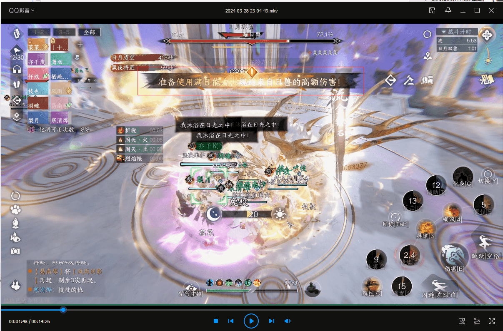
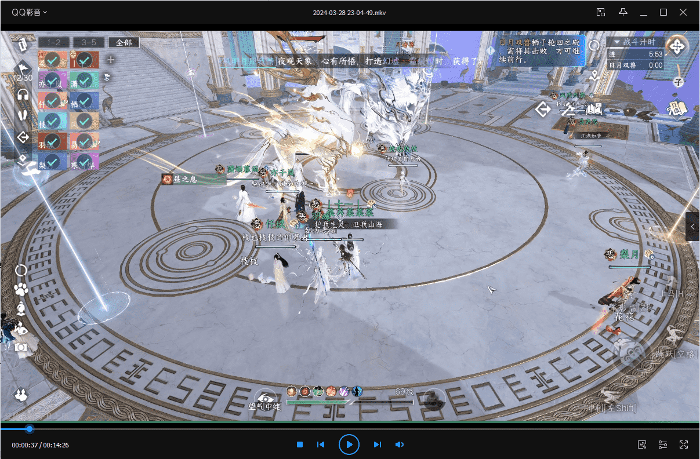
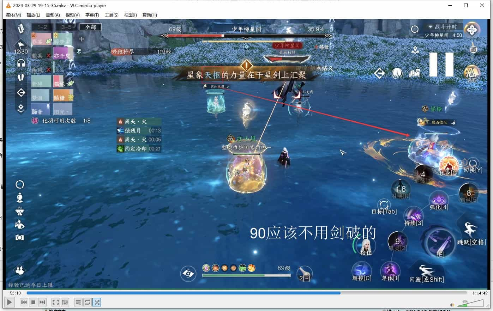

# 永夜星都·幻域（普通）机制一览

> 偏团长向，以拆机制细节为主，内容有点多，尽量在机制最开始带省流版

## 开打前的提示

> 如果团里有好友亲密度3000+的，可以双方带上一线牵
> 
> 且由于普通本`没有秒伤统计`,建议想办法**拿到赌徒特质**，下掉乘风破浪/王者风华，可以一定程度上提高秒伤

# 1.老一 涟

> 没什么特别要注意的，躲泡泡，打蚌壳，被点名躲御T身后即可。
> 
> 2024-03-30 16:56:19：老一过的其实很莫名其妙，建议再参考一下最近发布的其他攻略

## 1.1 莲

boss会吐泡泡，同时放海浪

***

奶妈拉约定其他人交解控；然后尽量别碰泡泡，海浪的伤害不到秒人的程度

## 1.2 侍奉武器

场地内会出现四个头上有武器名称的小怪，当三只小怪被击杀后，BOSS会使用最后一把武器攻击玩家。

***

集火秒掉头上为**蚌壳**的小怪，再随便处理两个即可，剩余的武器没有威胁。

## 1.3 点名机制

会有玩家被红圈点名，一定时间后受到巨额伤害。

***

迅速**找到御T**并躲在身后即可。

# 2.老二 日月双兽

> 不要让双怪合体，白天打百兽，黑天打黑兽；会有**黑夜将至/白昼到来**的倒计时。
> 
> 多捡地上的日光/月能球，尽量让充能条接近一百。

## 2.1 日月双珠

日珠子会吸引日兽仇恨，月珠子会吸引月兽仇恨

***

很像舞阳老三需要捡的香，根据需求分配双御T捡起即可。

## 2.2 烈日射线（日兽）

BOSS锁定两位玩家喷射激光，有巨额伤害

***

远离大团躲避即可，奶妈可稍微留意一下状态。

## 2.3 日能光球（日兽）

白天开始时，会有一些光球出现；

在烈日射线之后，BOSS会**跳回至中间**，同时还会刷新小鹿，击杀小鹿后也可以获得光球，光球充满后可以使用技能

***

如果需要节约输出，可以让龙吟碎梦去清；尽快充能到100就行。

2024-03-30 17:06:59 小鹿向外走的时候是有冲撞伤害的，需要DPS避免被撞到

## 2.4 终结技-流金砾石（日兽）

BOSS会释放全屏高额伤害技能

***

站在BOSS脚下释放防护罩，一般放一两个就行，节约后续充能时间；

请注意，输出的时候**一定注意位移**，不要位移到防护罩外面

2024-03-30 17:05:56注：释放盾的时间不用太早，当看到BOSS血条下面非常明显的黄条时，就可以放了

图图图

## 2.5 护盾（月兽）

boss会获得高额的护盾

***

在日兽释放冲刺技能时，拉日兽的铁衣将BOSS拉到月兽的身上就可以破盾；随后拉开BOSS

2024-03-30 17:07:43注：吸引日兽的T的将红色的箭头对准月兽即可，不需要跑过去

## 2.6 月能球获取方式

周围会出现可治疗的小鹿，由奶妈进行治疗即可获得月能球

***

2024-03-30 17:08:38 建议让大团在中间，吸引日兽的T在角落，这样奶妈治疗可以少走点路节约时间

## 2.7 爆炸旋涡

地图四周会出现需要15秒内击破的旋涡，如不击破，每个旋涡会带来高额的爆炸伤害

***

2024-03-30 17:09:28注：因为总限时是15秒，推荐的思路是一/二队的所有DPS去按顺序集火旋涡

比如一队DPS集火1/2，二队DPS集火3/4

具体情况请根据自己团队的输出情况安排，如果不是特别吃紧可以考虑全部都去。

下面是一张参考点位图

## 2.7 终结技（月兽）

在月能球充能完毕后，使用月能球技能规避BOSS终结技伤害即可

## 2.8 攻击力提升机制

如果提早打掉了其中一只BOSS，另外一只会提升攻击力（类似禁阁老五）

以及如果从黑夜转换为白天时（“白昼到来”读秒条消失）还在打月兽，会触发日兽的**护友之心**，也会提升攻击力。

2024-03-30 17:10:12注：但和老五不一样的是，不用担心会秒死，尽快打掉即可。

# 3.老三 少年柳星闻

> 机制比较多，我尽量拆细点，看开荒的秒伤可能还是要多注意细节的

## 3.1 双连冲

无读秒条

第一段冲刺BOSS脚下**三个白圈**，正面有**矩形范围伤害**

BOSS转身后，开始第二段冲刺，只有**正面矩形伤害**。

***

躲，不要贪伤害

## 3.2 扇形伤害

无读秒条

会释放四个扇形，有**两段伤害**。

第一段为从BOSS至扇形边缘的扩散伤害；第二段为扇形范围从地面上抬的伤害。

***

躲在缝隙里，不要因为贪伤害提前回到扇形里。

## 3.3 昊天落星

`9秒`读秒条

随机选取一名玩家脚下白圈，需要分摊伤害

***

被点名的人迅速到BOSS脚下，奶妈开约定，其他人开解控，共同分摊伤害。

2024-03-30 17:11:09注：因为目前手机有看不到圈的问题，建议指挥看读秒条，提前提醒大团贴紧BOSS（在冲刺结束后）

等醒目提示“分摊伤害”到了之后按上面来处理即可。

## 3.4 王宇星坠

`9秒`读秒条

视角转变为超远视角，会先出现三波白圈，再出现黄色可弹反的圈；循环至BOSS被击破为止

***

白圈需要**及时躲避**，黄圈需要共计**20人次弹反**方可击破BOSS。善用三段跳、冲刺以便及时弹反。

> 如果有看不清自己在哪儿的，可以参照以下方法
> 
> * 看BOSS连线指向的位置（适合已经瞄准BOSS为目标的情况）
> * 打开一键屏蔽，屏蔽其他角色模型；建议提前设置好。

2024-03-30 17:13:04注：建议大团在能保命的前提下在中间范围活动，方便看到黄圈之后三段跳去弹反。

指挥可以注意，如果某次所有人都弹反了，那么下一轮不会出现白圈。

## 3.5 时空裂隙

`5秒`读秒条

该机制下会展开时空裂隙，将玩家传送至不同的时空。

>朝(**zhao**)-过去: 随机刷新竞天阁5个boss，伤害很低，所以不需要奶妈，但是血量比较厚，很考验4个输出的秒伤。
>
>现在：和少年柳星闻对战，少年柳星闻会藉由裂隙学习到新的技能。
>
>夜-未来：会出现柳星闻，伤害很高，血很厚，无需输出，躲避各类释放技能即可；**不要硬抗伤害**，会有易伤BUFF

***

分组的话大致思路是：四个高DPS去朝，一个肉T+1或两个素问+低DPS去夜，剩余人留在现在。

> 夜需要一个素问还是两个素问去，请根据自己团队肉T的情况而定。
> 
> 如果真的需要两个素问去了，留在现在的队友请带上笛子自保。

朝夜的处理方式很清楚了，留在现在的队友需要注意柳的新机制，下面也会讲到。

***

2024-03-30 17:14:44注：这边的机制需要再做个补充

> 去未来的队友，请让T一直保持在一仇对象，不用输出也不要输出；既是打不死也是防止转移仇恨，吃到不必要的伤害。
> 
> 去过去和现在的队友，最好能各指定一个人打好小抄，开麦或者及时打字，方便应对读诗的机制。
> 
> 未来的T：请带好刹那和铁壁，在BOSS平A抬手的时候释放，一般两次释放完了其中一个技能CD就快转完了；有条件可以去看看实况录像或者人机体验一下；核心就是为了不连续吃到过高的DEBUFF

## 3.6 冲刺

无读秒条

柳星闻蓄力，向其矩形长条方向冲刺，蓄力位置会留有白圈

***

避开柳星闻这个技能的正面和背面，远程如果需要输出可以在侧面非伤害区域毛伤害。

## 3.7 吟风咏月（最考验文化水平的机制）

`14秒`读秒条

在朝和现在的队友会同步出现该机制。

柳星闻会给出两句诗，头顶有正确文字的玩家，需要依次传功给柳星闻

***

注意顺序，如果有条件建议不同时空的人在该环节都开麦。

除了传功的人之外，其他人可以趁这个时候毛伤害

## 3.8 观星窥象

`14秒`读秒条

除了离BOSS最近的人之外，其他三个人会被禁锢。

需要未被禁锢的玩家引导**幼年柳星闻**发射的球撞到相同颜色的光环上。

***

* 站位建议在三个被禁锢的人的身后
* 引导球速度较快，善用燕回风和多段跳
* 被解救出来的人**远离幼年柳星闻**的位置（最好是背后），防止不慎吞掉球

2024-03-30 17:22:32注：每次出现的球，在BOSS血条下方的提示条会有对应的颜色文字。

## 3.9 公孙大娘圈

类似公孙大娘时的黑白圈，只要圈内人数符合即可，没有之前的捡球机制。

***

2024-03-30 17:20:14注：它这个圈的机制是，第一个圈出现，有人站进去之后，才会出第二个圈；所以有要**毛伤害的队友**注意一下这个细节。

## 3.10 大范围白圈

BOSS血量只剩`17%`时会回到中间，展开一个大范围白圈，会有巨额伤害。

***

从实况视频看优先建议躲避，如果输出不够可以考虑奶妈拉约硬抗。

2024-03-30 17:21:16注：也可以考虑集中在中间，全开解控，和上面分摊伤害的思路差不多。

> 后记：因为时间比较紧张 所以只是抽空消化了一下，可能会有一些出入，欢迎各位指正。