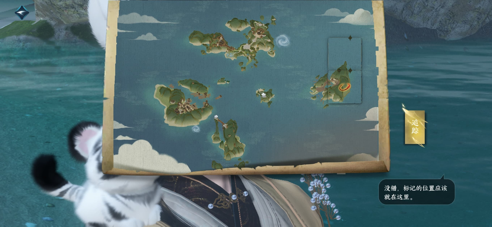

# 1.2.0部分独珍道具探索指引

> 写在前面：这篇攻略是根据群里群友发的图片（忘了是谁）汇总出来的，部分攻略有亲自跑过，如果有要注意的内容会有额外标识。

1．闲游特质-驱雷策电:`823,836`

2．驭雷盾:`811,782`

3．闲游特质-虚形:`302,614`

4．叶凌云腰带，直接呼吸里点追踪可能需要手爬悬崖

> 坐标在`316,610`的山崖上，可以先去拿`绝技上卷`再顺带打掉叶，与叶对话触发战斗

5．绝技上卷:`282,610`

> 绝技上卷和上面提到的叶凌云腰带所在坐标只有Z轴上的区别
> 
> 绝技上卷在房子顶端的山洞里，而腰带在山洞上方的山崖上

6．白衣剑客头盔（野外强敌）:`395,262`

7．袁公·越木藤手（野外强敌）:`867,74`

> 两个强敌都是只要蹭到伤害且被击败后即可拿到奖励

8．宁九霄戒指（探索任务）

直接呼吸里追踪，按步骤完成任务就好，任务中间会顺便打死两个野外强敌拿到独珍装备（公孙绯、藤木重久）

9．动作抱大腿:直接呼吸里点追踪，探索任务

10．梦蝶蜕（门派信物）:`888,1376`

11．青龙借剑:`441,1710`（呼吸点追踪方便点）

12．雷辎电胃特质＋探幽冥腾龙手`437,1603`（探索任务）

拼图的小黑点在右边的云朵下面一丢丢；先把宝箱开完，然后开大宝箱的密码是165；其他点任务自动寻路做完即可。

> 165的来源是，三伪者x五两黄金+三真x五十两黄金
> 
> 后续任务到浮光窟的时候，可以在宝箱附近多停留一会，有比较稀缺的`流光花`可以摘
> 
> 拼图的位置在下方供参考

13．南华经内篇:`1887,1175`

14．绝技下卷:`1888,1780`