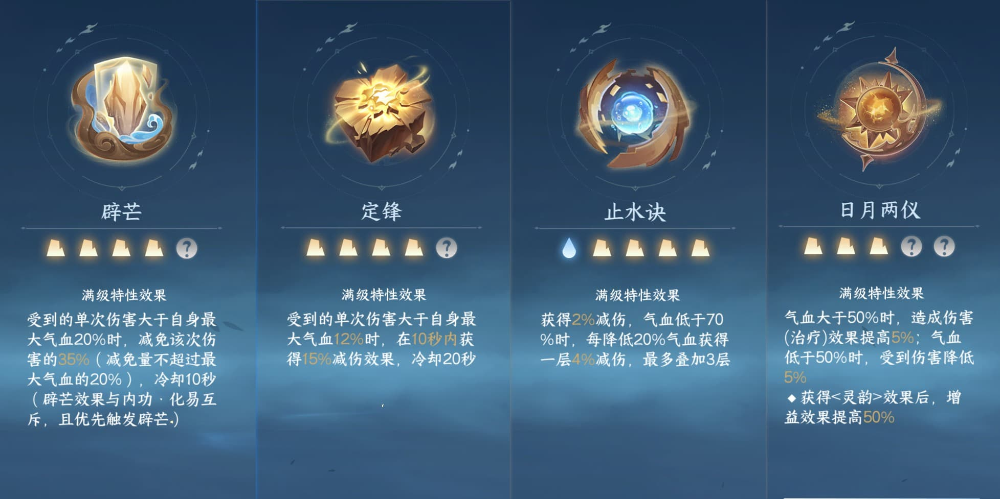
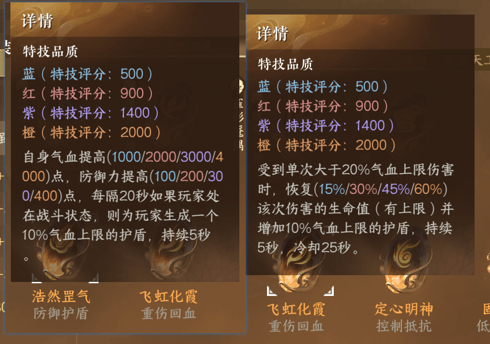
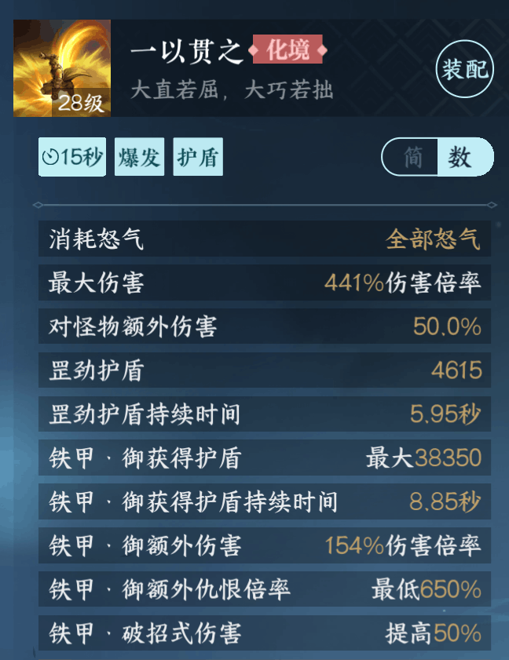
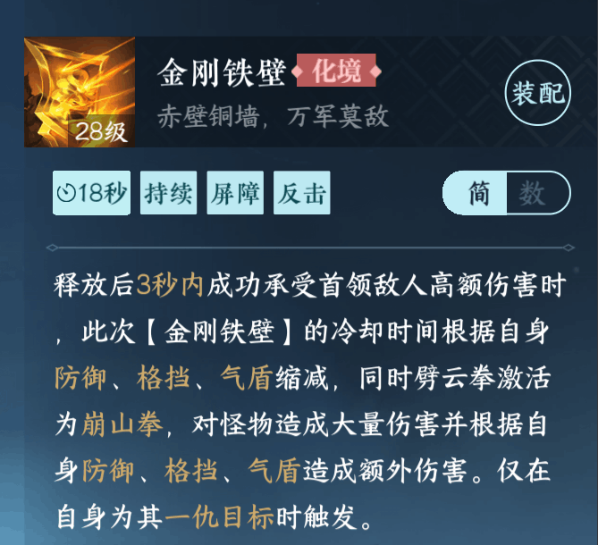
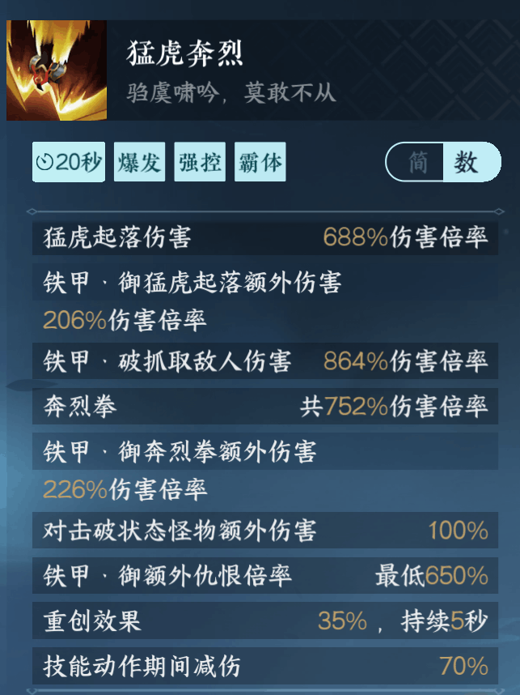
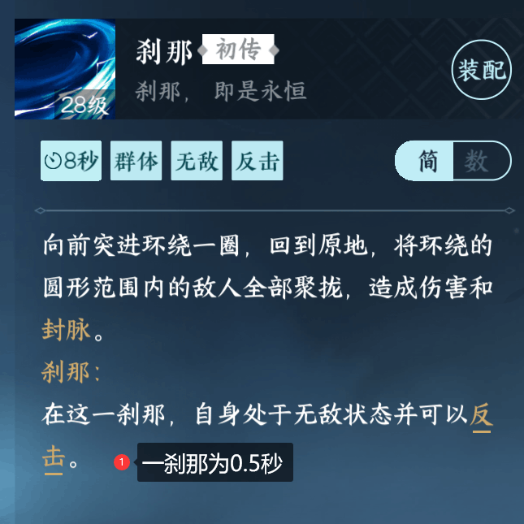
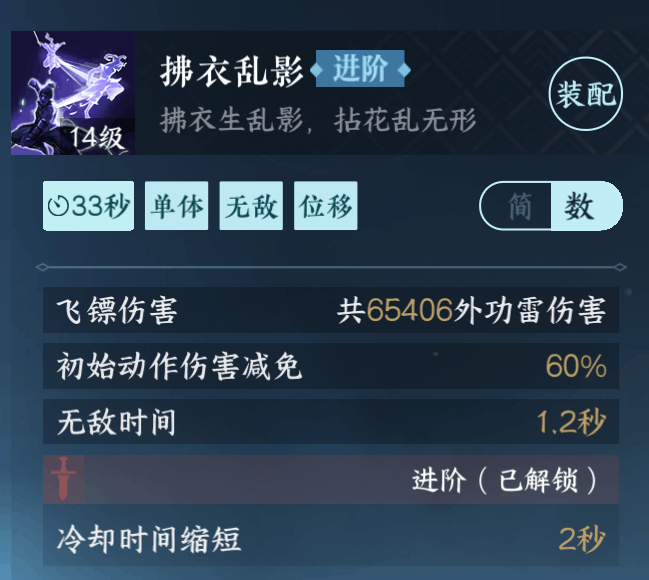
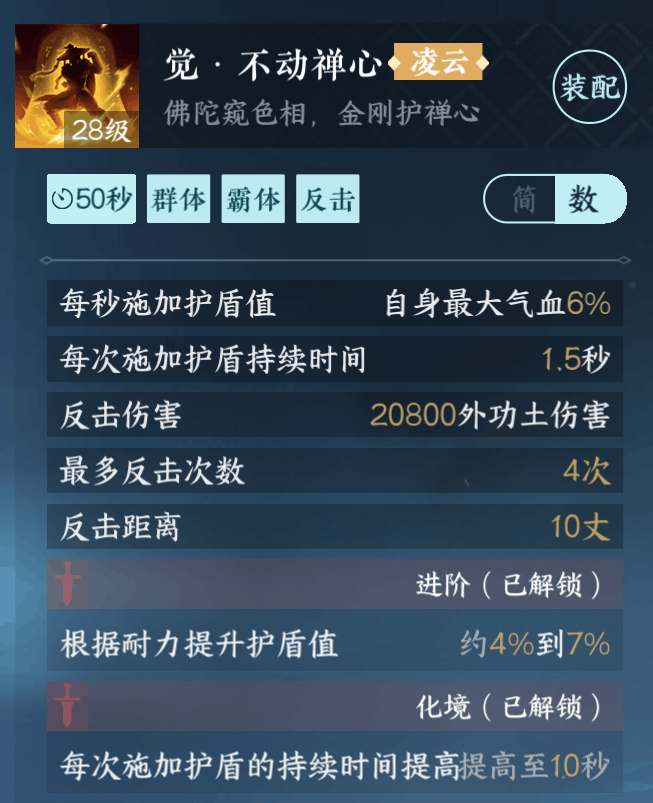

# 新手向铁衣减伤介绍

> 铁衣在副本周期内基本是会一直受到来自BOSS的伤害
> 
> 所以做好必要的减伤/抗伤处理非常重要
> 
> 这边直接从可以做的地方去介绍，就不过多讲原理类的内容了
> 
> **页面可双指缩放，方便查看图片**

## 1.带有减伤效果的内功

思路上是包含防御/减伤标签的都可以，考虑到是新手向，我直接贴一下我推荐的新手期减伤内功。

后续如果感觉自己熟悉了有理解了，可以根据需求尝试调整搭配。

> 在凑的齐三土周天的前提下，不管是土日月还是火日月都是可以的

## 2.减伤效果打造

在护腕和甲胄部位上有护盾/减伤向的打造“浩然罡气”和“飞虹化霞”，在打造资源允许的前提下可以适当去打造一下。

需要注意的是，由于不同部位`不能应用名称相同`的打造，所以需要注意打造资源的合理使用。

## 3.各类减伤/无敌技能

### 3.1 铁衣本家技能

* 一以贯之

> 这个技能虽然目前伤害不如以前高了，但是在御形态的前提下可以用来定时产出**一定数额的护盾**。

* 金刚铁壁

> 这个技能严格上来讲不是减伤/无敌技能，但是**反击**BOSS的**普攻**（也称平A）的时候很好用
> 
> 在看到BOSS平A动作起手时（也就是动作开始）时使用这个技能，听到**叮**的一声就说明**反击成功**了
> 
> 更进阶的是，在这个技能反击成功后，你可以按普攻键使出特殊攻击**崩山拳**，简单来说就是能多打点输出

* 猛虎崩裂

> 简单来说，在**释放招式期间**，可以有`70%`的减伤。
> 
> 它的触发方式**非常多样**，可以连续普攻六下/使用擒龙/开山拳进行触发（即显示出技能按钮）

### 3.2 流派潜学技能（看看就行）

* 刹那

> 属于流派潜学技能内的唯一推荐，但这个比较进阶了，所以不作为本文内的推荐

### 3.3 百家/群侠技能

* 拂衣乱影

> 有1.2秒的无敌效果时间，可以用来紧急躲避一些巨额伤害

* 不动禅心

> 它是一个增加护盾且带有反击的技能，通常来说就是你会在1.5秒获得一个自身血量9%的护盾
> 
> 而且它还带有反击效果，可以抵挡BOSS的部分平A动作，建议在资源充裕的前提下升阶到化境（也就是二阶）

## 4.后记

这篇减伤介绍比较参考个人经验，且考虑到萌新向，所以直接喂饭并做一些简单的解释。可能会有遗漏或者不当的地方，欢迎提问。