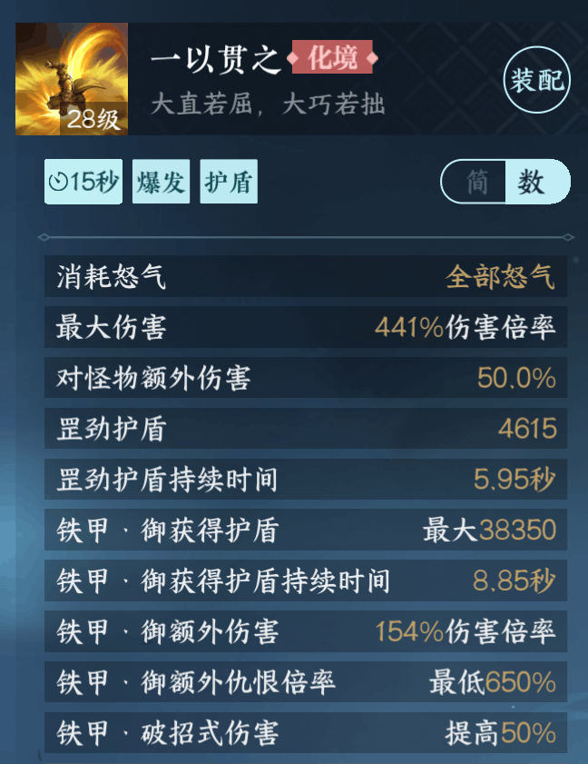

# 铁衣仇恨机制

> 建议先看第三节，有不懂的地方再回来看，或者直接问我。

## 1.什么是仇恨

仇恨是副本内Boss索敌（**确定攻击对象**）的一种机制

> 对怪物造成伤害会产生仇恨，怪物将根据仇恨的高低优先攻击最高的目标

一仇对象显示的位置如下图红圈1所示

在Boss除开BOSS在副本进程中的特殊攻击机制会有自己的索敌方式外，在副本进程中的其他时间Boss都会根据仇恨机制来索敌。

## 2.影响仇恨值的因素

我在《新手向铁衣简单介绍》里简单提过仇恨值的概念

> 仇恨值简单的说就是团队成员打BOSS之后，BOSS的怒气值
>
> 而BOSS除了特殊攻击以外，只会对最让他生气的人（也就是**仇恨值最高的人**）发动攻击。

但是在实战中，会有各种因素影响**Boss对我方团队队友**的仇恨值。

在讲定义之前，我先引入一个例子，这个例子仅为了方便理解，不考虑其他方面。

> 班级里有一个同学叫小牧，他有天偷偷制作毒蛊被老师发现，老师在下课前当众批评了他。
> 
> 同学们知道这件事后，趁老师下课对小牧展开了批评攻势。
> 
> A：大部分同学批评他不顾其他人的安危，擅制危险的毒蛊，不负责任；小牧觉得很是愧疚，**没什么负面情绪**
> 
> B：小部分同学情绪比较激动，在批评小牧的同时还对小牧说了一些难听的脏话；小牧觉得**有丢丢生气**
> 
> C：有极个别同学，性格过于暴躁，嘴里骂骂咧咧的就过来打了小牧两拳；小牧觉得**很生气**，想要反击的时候，两边都被其他同学拉住了

OK，例子讲完，要正式列一下影响仇恨值的因素了。

### 2.1 基础伤害

单个输出对象对BOSS造成伤害时，BOSS会根据前者造成的伤害值根据**仇恨值公式**累计对前者的仇恨。

仇恨值 = 一段时间造成的伤害 × 该段时间的仇恨倍率

### 2.2 仇恨倍率

在输出时，有一些技能/特质会影响到仇恨倍率

#### 1.百家技能：打虎一式

打虎一式是游戏内目前唯一会增加仇恨倍率的**百家技能**

它会在`15秒`技能持续时间内提升仇恨倍率（100%+150%=250%）

由于它是个增加伤害的技能，**输出职业**可能会用到它（铁衣自身特性不需要使用，而且也会增加受到的伤害）；也就可能导致这段时间里输出的仇恨值快速上升。

#### 2.流派特质：铁甲

铁甲是铁衣流派的默认特质，通俗来说铁衣的所有招式（普攻和技能）都会有500%（基础100%+提升400%）的仇恨倍率。

所以这就是我提到的铁衣的平均秒伤只要在**最高输出平均秒伤的百分之二十**左右即可的原因。

#### 3.流派技能：一以贯之

在释放一以贯之时，会给予敌方BOSS当前技能伤害额外650%的仇恨值。

说是额外的仇恨值，原因是铁甲本身已经能提供500%的仇恨值了。

其中原理我没细究过，但是多砸它对稳仇很有帮助。

#### 4.流派技能：猛虎崩裂

在释放一以贯之时，会给予敌方BOSS当前技能伤害额外650%的仇恨值。

额外仇恨值的原因和一以贯之是一样的，就不再赘述了。

### 2.3 强仇技能

强仇定义如下

> 强仇期间，复制**当前一仇目标的仇恨值**，使自身强制成为怪物的第一仇恨目标，吸引怪物的普通攻击。
> 
> 强仇效果期间（5秒）即便其他队友的仇恨量超过自己，也无法成为怪物的第一仇恨目标。

释放了强仇技能后，会首先

这边简单讲一下，铁衣流派有两个强嘲技能

擒龙和狮吼，分别是一个13.5秒和11.6秒的技能

但在**首领BOSS的前提**下，可以把擒龙看做一个`8.5秒`的技能，因为擒龙如果无法把怪物吸过来会返还五秒冷却时间。

如果你释放了一个强仇技能，那么下一个强仇技能应该在至少五秒钟之后再放，这样更好去利用强仇技能的时间。

而霸者围栏和岳飞群侠由于使用率不高，可以先略过。

### 2.4 回到例子

A/B/C三种情况对应的实际就是上面提到的基础伤害/仇恨倍率/强仇技能。

> 基础伤害需要有巨额的输出才能将仇恨提到团队第一
>
> 高仇恨倍率可以让达到同一仇恨值的所需伤害变得非常低
>
> 强仇技能就是一种快速让自己成为一仇目标

## 3.稳仇建议

1) 如果你是主T（主要吸引仇恨的铁衣），那么一定要你对BOSS造成第一次伤害（俗称首刀）
2) 在自己是一仇对象的前提下，可以将一个或者两个仇恨技能**取消一键连招勾选**，
这样在出现一仇对象转移为非铁衣角色（即Over Tank，简称**OT**，也可称**乱仇**）的情况下，你可以及时的按下嘲讽技能将仇恨拉到自己身上。
3) 在你是一仇对象的前提下，你需要通过你的输出技能将仇恨值排名稳住，这部分技能可以使用一键连招，让系统帮你自动释放。
4) 额外增仇的技能一定要带上，比如**一以贯之**、**猛虎崩裂**等，这部分技能勾选一键连招即可。
5) 如果**你目前不是主T**，请先和你的另外一个T队友沟通好，什么时候需要你作为一仇对象（俗称拉怪）；如果没有特殊情况，可以先把嘲讽技能留着。

